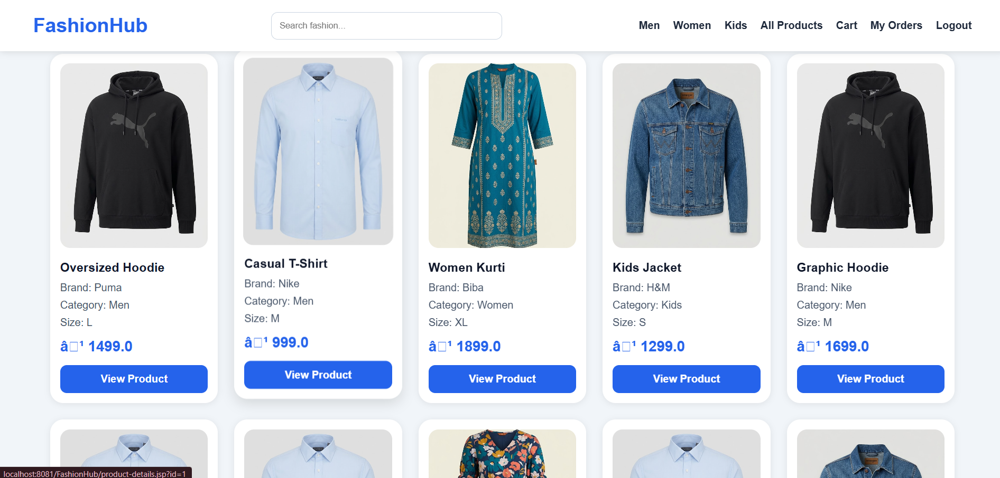
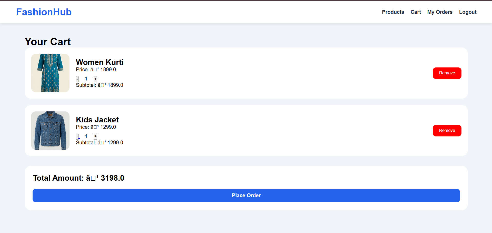

# FashionHub

FashionHub is a full-stack Java ecommerce web application built using JSP, Servlets, JDBC, MySQL, HTML, CSS, and Apache Tomcat.

The project includes authentication, product browsing, cart management, checkout, order handling, search, sorting, pagination, and a modern responsive UI.

---

# Features

* User Registration & Login
* Session Management
* Product Listing
* Product Details Page
* Search Products
* Category Filtering
* Price Sorting
* Shopping Cart
* Remove From Cart
* Checkout System
* Order Placement
* My Orders Page
* Stock Quantity Management
* Responsive Modern UI
* Hero Banner Section
* Product Images

---

# Tech Stack

## Frontend

* HTML
* CSS
* JSP

## Backend

* Java Servlets
* JDBC

## Database

* MySQL

## Server

* Apache Tomcat 10

## Tools

* Eclipse IDE
* Git
* GitHub

---

# Project Structure

```text
FashionHub
│
├── src/main/java
│   ├── controller
│   ├── dao
│   ├── model
│   └── util
│
├── src/main/webapp
│   ├── css
│   ├── images
│   ├── login.jsp
│   ├── register.jsp
│   ├── products.jsp
│   ├── cart.jsp
│   ├── orders.jsp
│   └── product-details.jsp
│
└── pom.xml
```

---

# Screenshots

## Login Page


## Products Page



## Cart Page



## Orders Page


---

# Database Setup

Create a MySQL database:

```sql
CREATE DATABASE fashionhub;
```

Update database credentials inside:

```text
DBConnection.java
```

---

# Run Project

1. Clone repository
2. Import project into Eclipse
3. Configure Apache Tomcat 10
4. Configure MySQL database
5. Run project on server

---

# GitHub Repository

Repository Link:

[https://github.com/MOHAMMADKUMEAL/FashionHub](https://github.com/MOHAMMADKUMEAL/FashionHub)

---

#
